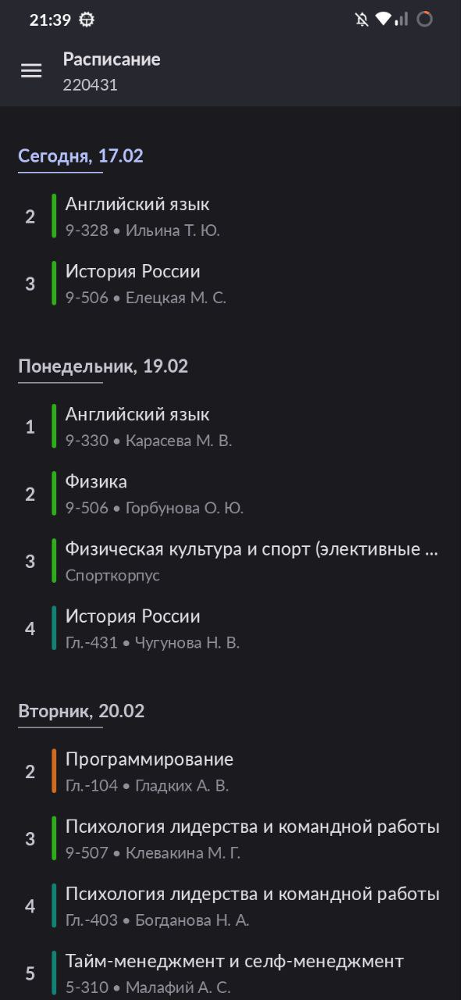
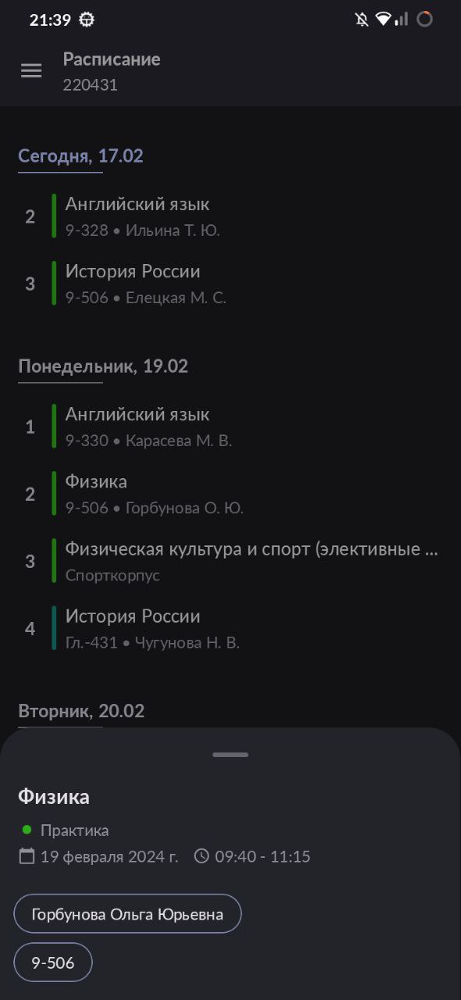
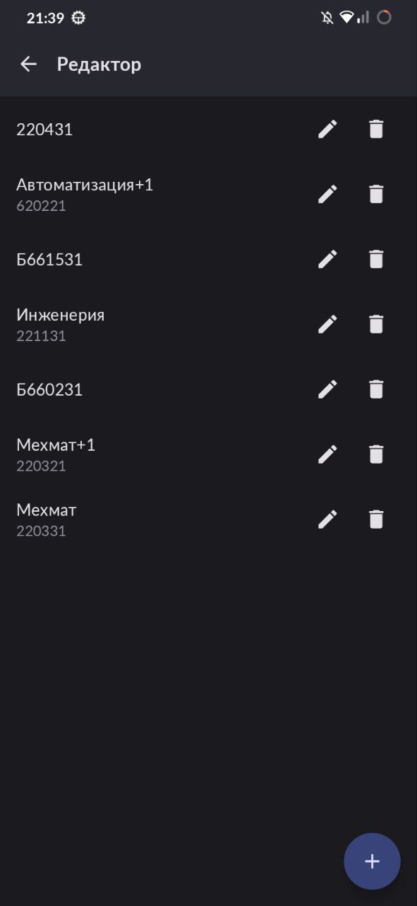

    

    
    
    
     
    Android приложение для просмотра расписания ТулГУ

## 💪 Функционал
Список функций приложения:
- Красивый интерфейс
- Сохранение своего id (номер группы, ФИО преподавателя или номер аудитории)
- Возможность сохранения нескольких id, чтобы их расписания были всегда под рукой
- Кеширование расписания, чтобы оно было доступно без подключения к интернету
- Редактирование имён предметов

## ⬇️ Установка
Приложение разработано для Android 7.0 и выше. Вы можете получить apk файл, скачав его либо здесь в [Github releases](https://github.com/subreax/Schedule/releases), либо в [телеграм канале](https://t.me/subreax_tsu_schedule).

## 📱 Скриншоты
 

 

## 👋 Совместная разработка
Есть желание улучшить данный проект? Добро пожаловать! Вы можете предложить новый функционал или сообщить о проблеме через issues, а также внести вклад в развитие через pull request.

## 👨🏻‍💻 Разработчики
- **subreax** (Морозов, 220431)

## ⚖️ Лицензия
Проект распространяется под лицензией [GNU General Public License 3.0](https://github.com/ReVanced/revanced-manager/blob/main/LICENSE), [tl;dr](https://www.tldrlegal.com/license/gnu-general-public-license-v3-gpl-3): You may copy, distribute and modify the software as long as you track changes/dates in source files. Any modifications to or software including (via compiler) GPL-licensed code must also be made available under the GPL along with build & install instructions.
